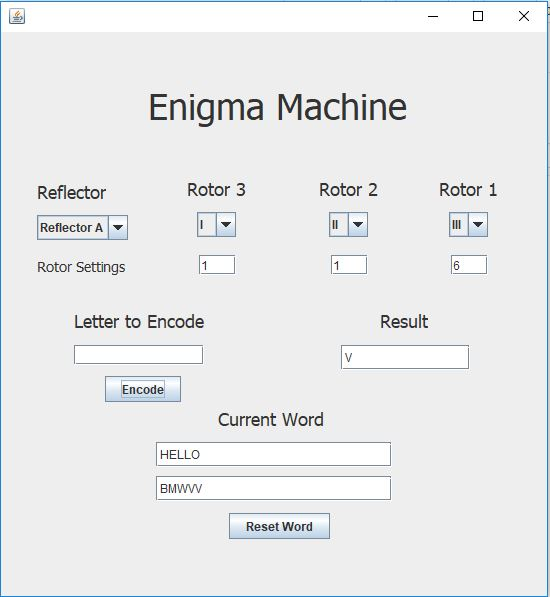
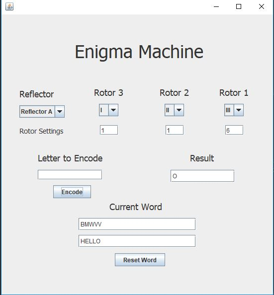

# Enigma

My first personal project with Java swing framework. This program is a clone of the Enigma machine the German army
used to encode their messages in WWII. Alan Turing cracked this which assisted in the winning of the war, all rotors and 
reflectors in this project are coded exactly as they were in WWII. The cool part about an Enigma machine is that two of the same letters won't be encoded as the same letter see the example below.

  
To encode a message you select which rotor numbers you want to start at then type your message.
  
To decode a message you switch the rotor number to the initial numbers the message was encoded in (1,1,1 for my case) then type the message in.Message should now be decoded :).
